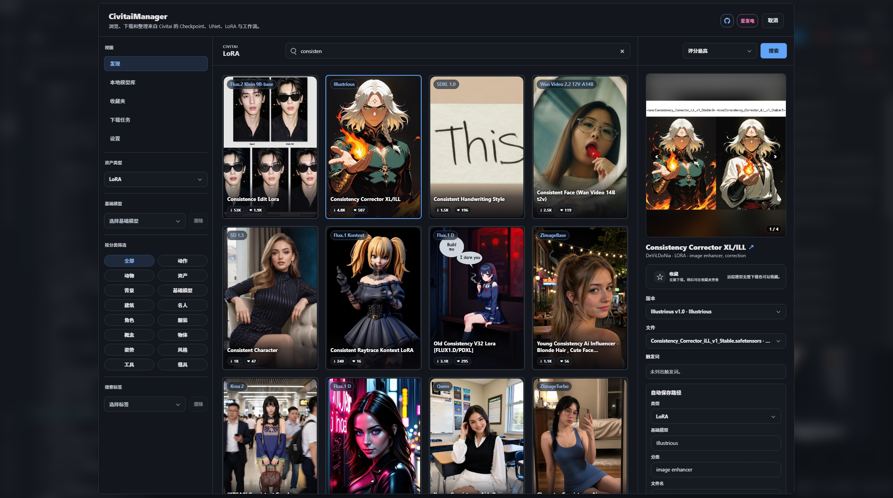
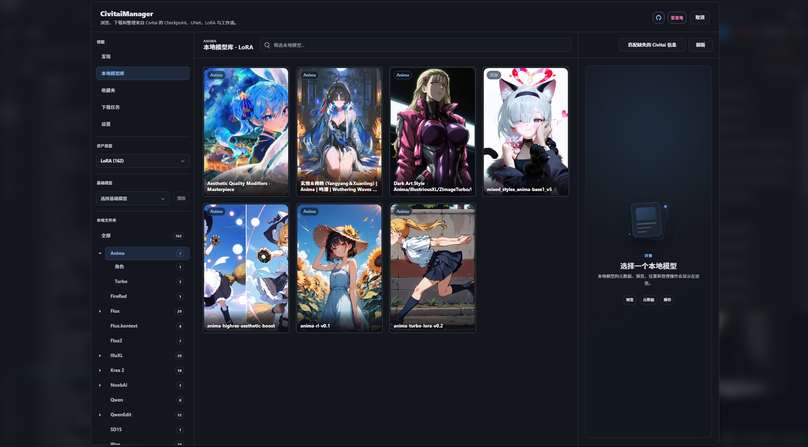
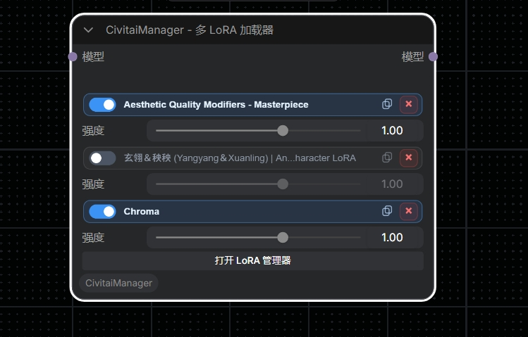

<div align="center">

# CivitaiManager

### 在 ComfyUI 内完成 Civitai 模型的发现、下载、整理与使用

[](https://github.com/nregret/CivitaiManager)
[](https://registry.comfy.org/zh/publishers/nnegret/nodes/CivitaiManager)
[](https://www.python.org/)
[](https://github.com/comfyanonymous/ComfyUI)
[](https://github.com/nregret/CivitaiManager)

**CivitaiManager** 是一个面向 ComfyUI 的一站式 Civitai 资源管理扩展。<br>
无需离开工作流界面，即可浏览、筛选、下载和整理 **Checkpoint、UNet、LoRA 与 Workflow**，并通过专用的多 LoRA 加载节点直接投入创作。

[界面预览](#功能与界面) · [安装](#安装) · [快速开始](#快速开始) · [常见问题](#常见问题) · [支持项目](#支持项目)

</div>

<p align="center">
  
</p>

> 从“找到模型”到“放进工作流”，尽可能只做一次选择。CivitaiManager 将在线资源、本地模型、收藏夹、下载任务和多 LoRA 节点连接成一条完整链路。

## 功能与界面

### 在线发现：浏览、筛选与下载

在 ComfyUI 内直接访问 Civitai 资源。卡片列表负责快速浏览，右侧详情面板用于确认版本、文件、预览图与触发词；选定资源后即可按照自动规划的目录加入下载队列。

- 覆盖 Checkpoint、UNet、LoRA 与 Workflow。
- 支持关键词、基础模型、分类、标签和排序组合筛选。
- 支持多版本、多文件和多预览图切换。
- 可在下载前确认资源类型、基础模型、分类和文件名。

<p align="center">
  
</p>

### 本地资源库：让模型目录真正可管理

CivitaiManager 会读取 ComfyUI 已解析的模型目录，并把散落在不同根目录和子文件夹中的资产整理成统一视图。你可以快速定位模型、查看预览与元数据，也可以批量补全缺失的 Civitai 信息。

- 文件夹树展示资源分布与数量。
- 支持按资源类型、基础模型和本地目录筛选。
- 支持移动、重命名、收藏与删除资源。
- 移动资源时同步更新 companion JSON、预览图和相对路径信息。
- 支持通过 SHA256 匹配缺失的 Civitai 元数据。

<p align="center">
  
</p>

### Multi LoRA Loader：从管理器直接进入工作流

`CivitaiManager - Multi LoRA Loader` 将多个 LoRA 收纳在一个清晰的节点中。条目按照界面顺序依次应用，每个 LoRA 都有独立开关和强度控制。

- 在节点中启用、停用、调整或移除 LoRA。
- 从节点打开精简 LoRA 管理器，搜索远程资源或浏览本地 LoRA。
- 支持“下载并应用”，减少下载后再次查找文件的操作。
- 支持调整应用顺序；缺失文件会安全跳过并输出日志，不中断整个列表。

<p align="center">
  
</p>

### 设置：路径、内容偏好与伴随文件

设置页集中管理 Civitai 访问能力与下载行为。模型目录直接来自 ComfyUI 配置，Workflow 可以指定独立保存目录。

- 保存并测试 Civitai API Key。
- 控制是否允许 NSFW 搜索结果。
- 选择是否保存模型元数据 JSON 与预览图。
- 查看 Checkpoint、UNet、LoRA 和 Workflow 的实际解析目录。

<p align="center">
  
</p>

### 收藏夹与下载任务

收藏不再依赖模型是否已经下载。远程模型可以先加入收藏夹，之后下载到本地时会按照 Civitai 模型 ID 和资源类型自动合并为同一条记录。

下载任务在后台运行并持久化到用户目录。关闭管理器不会中断状态记录；ComfyUI 重启后，未正常结束的任务会标记为失败并可重新入队。

## 安装

<details>
<summary><strong>展开安装说明</strong></summary>

<br>

### 方法一：ComfyUI Manager（推荐）

1. 打开 ComfyUI Manager。
2. 搜索 `CivitaiManager`。
3. 点击 **Install**。
4. 安装完成后重启 ComfyUI。

也可以访问 [Comfy Registry 中的 CivitaiManager](https://registry.comfy.org/zh/publishers/nnegret/nodes/CivitaiManager) 查看已发布版本。

### 方法二：Comfy CLI

```bash
comfy node install CivitaiManager
```

安装完成后重启 ComfyUI。

### 方法三：Git 克隆

在 ComfyUI 的 `custom_nodes` 目录中执行：

```bash
git clone https://github.com/nregret/CivitaiManager.git
```

然后重启 ComfyUI。项目不需要额外执行 `pip install`。

</details>

## 快速开始

1. 重启 ComfyUI 后，点击左侧边栏的 **Civitai** 入口；旧版前端会显示兼容的悬浮入口。
2. 第一次使用建议先进入 **设置**，填写 Civitai API Key，并确认模型与 Workflow 保存目录。
3. 在 **发现** 中选择资源类型并搜索模型，打开卡片查看版本和文件详情。
4. 确认自动保存路径后加入下载队列，在 **下载任务** 中查看进度。
5. 进入 **本地模型库** 管理已下载资源，或在工作流中添加 `CivitaiManager - Multi LoRA Loader`。

> Civitai API Key 不是浏览公开内容的绝对前提，但建议配置，以获得更稳定的访问体验和与你账户权限一致的内容结果。

## Multi LoRA Loader 使用方式

在节点菜单的 `CivitaiManager/Loaders` 分类中添加：

```text
CivitaiManager - Multi LoRA Loader
```

连接方式：

```text
MODEL → CivitaiManager - Multi LoRA Loader → MODEL
```

点击节点中的 **打开 LoRA 管理器**，即可搜索、下载、应用和管理 LoRA。节点会把 LoRA 路径、强度、开关与顺序保存在工作流中。

## 常见问题

<details>
<summary><strong>展开常见问题</strong></summary>

<br>

### 为什么本地模型没有预览或 Civitai 信息？

在 **本地模型库** 中点击 **匹配缺失的 Civitai 信息**。管理器会计算 SHA256，并尝试匹配对应的 Civitai 文件记录。

### 下载后的文件保存在哪里？

Checkpoint、UNet 和 LoRA 使用 ComfyUI 已配置的对应模型目录；Workflow 使用设置页指定的 Workflow 目录。实际解析结果会显示在设置页右侧。

### 可以同时管理多个模型根目录吗？

可以。本地资源库会读取 ComfyUI 为各资源类型配置的全部根目录，并保留每个资产所属的存储根标识。

### 为什么取消下载不是瞬间完成？

取消会在网络读取边界生效。如果底层请求正处于阻塞读取，可能需要等待当前读取或超时返回。

</details>

## 反馈与贡献

欢迎通过 [GitHub Issues](https://github.com/nregret/CivitaiManager/issues) 提交问题、功能建议和兼容性反馈。反馈问题时，建议附上：

- ComfyUI 与前端版本
- 操作系统和 Python 版本
- 可复现步骤
- 浏览器控制台或 ComfyUI 终端中的相关错误

<details>
<summary><strong>项目结构与开发验证</strong></summary>

```text
CivitaiManager/
├── __init__.py                 # ComfyUI 扩展入口与 Web 目录声明
├── nodes.py                    # API 注册与 Multi LoRA Loader 节点
├── manager_api.py              # 后端编排与 API handlers
├── backend/
│   ├── client.py               # Civitai 请求辅助
│   ├── config.py               # 配置读取与校验
│   ├── downloads.py            # 持久化下载任务
│   ├── library.py              # 本地资源索引缓存
│   └── routes.py               # HTTP 路由表
├── js/
│   ├── civitai_manager.js      # 主管理器 UI 与交互
│   ├── civitai_lora_node.js    # Multi LoRA 节点与精简管理器
│   └── civitai/                # API、状态、收藏、样式与国际化模块
├── locales/{en,zh}/            # ComfyUI 官方 locale 资源
├── img/                        # README 界面截图
├── tests/                      # 后端与节点回归测试
└── pyproject.toml              # Comfy Registry 发布元数据
```

运行验证：

```powershell
python -m unittest discover -s tests -v
python -c "import ast,pathlib; files=list(pathlib.Path('.').glob('*.py'))+list(pathlib.Path('backend').glob('*.py')); [ast.parse(p.read_text(encoding='utf-8'), filename=str(p)) for p in files]"
Get-ChildItem js -Recurse -Filter *.js | ForEach-Object { node --check $_.FullName }
```

测试使用临时目录和 ComfyUI 模块替身，不访问网络，也不会修改真实模型目录。

</details>

## 支持项目

如果 CivitaiManager 帮你节省了整理模型和搭建工作流的时间，欢迎点一个 **Star**，或在爱发电请作者喝一杯咖啡。你的支持会用于持续维护、兼容新版 ComfyUI，并开发更多实用功能。

<p align="center">
  <a href="https://www.ifdian.net/a/nnegret?utm_source=copylink&utm_medium=link">
    
  </a>
</p>

<p align="center">
  感谢每一位使用、反馈和支持 CivitaiManager 的朋友 ☕
</p>
